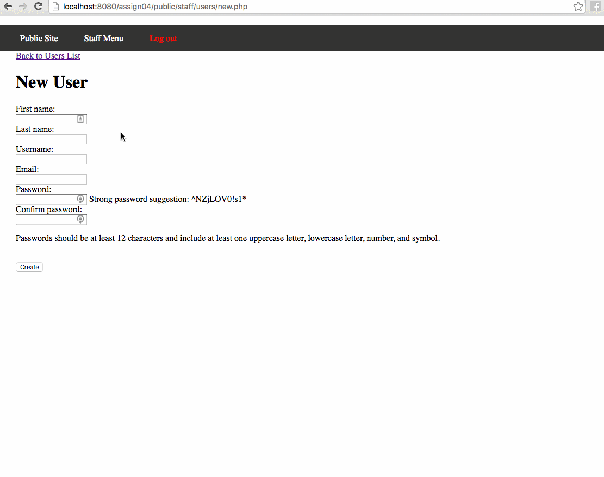

# Project 4 - Globitek Authentication and Login Throttling

Time spent: **10** hours spent in total

## User Stories

The following **required** functionality is completed:

**(all required stories completed)**

- [x] On the existing pages "public/staff/users/new.php" and "public/staff/users/edit.php", a user sees the appropriate forms
- [x] For both users/new.php and users/edit.php, submitting the form performs data validations
- [x] If all validations on the user data pass, encrypt and store passwords
- [x] Use PHP's password_verify() function to test the entered password against the password stored in users.hashed_password for the username provided and Ensure the login page does not display content which would create a User Enumeration weakness
- [x] Implement login throttling
- [x] Reset failed logins after a successful login
- [x] Watch out for SQLI Injection and Cross-Site Scripting vulnerabilities

The following advanced user stories are optional:

**(all optional stories completed)**

- [x] Bonus 1: Identify the User Enumeration weakness and write a short description of how the code could be improved
  - [x] **(explanation in Notes section)**
- [x] Bonus 2: A blank password will still allow updating other user values and not touch the existing password, but providing a password will validate and update the password too
- [x] Bonus 3: Use the options to set the bcrypt "cost" parameter to 11
  - [x] **(explanation in Notes section)**
- [x] Bonus 4: On "public/staff/users/edit.php", add a new text field for "Previous password". When the form is submitted, validate that the correct password has been provided before allowing the password to be updated
- [x] Advanced 1: Implement `password_hash()` and `password_verify()` same functions yourself using the PHP function crypt() and the bcrypt hash algorithm. Name your versions `my_password_hash()` and `my_password_verify()` and include them in "private/auth_functions.php"
- [x] Advanced 2: Write a PHP function in "private/auth_functions.php" called `generate_strong_password()` which will generate a random strong password containing the number of characters specified be a function argument

## Video Walkthrough

Here's a walkthrough of implemented user stories:

GIF created with [LiceCap](http://www.cockos.com/licecap/).

## Notes

* **Bonus Objective 1:** The subtle User Enumeration weakness with the login pages comes from timing. When a login is submitted, the server only hashes the attempted password if the attempted username belongs to a valid user. An attacker may then be able to measure these minute response timing differences to detect valid usernames. This is exacerbated by the fact that bcrypt takes a relatively long amount of time.
* **Bonus Objective 3:** It is still possible to login after changing the bcrypt's cost parameter because `password_verify()` looks at the metadata stored at the beginning of the hashed password (e.g. $2y$10$salt) to detect which encryption algorithm and what options (such as cost) to use.
* To complete bonus objective 2 (and partially bonus objective 4) I added a flag to the `validate_user()` function to differentiate between when it is used to verify editing a user vs creating a new one. If implemented exactly per the instructions, it would allow the creation of a new user with a blank password.
* When creating a new password, I set a maximum length of 72 characters. Whereas this may not be the best requirement in theory, php's [password_hash](http://php.net/manual/en/function.password-hash.php) function will truncate it at 72 characters, so in this case it is the best practical option.
* The edit user page has an interesting bug where you are not able to change the username and password in the same attempt. This is due to the way that the previous password is verified against the password of the user. 

## License

    Copyright [2016] [David Maydew]

    Licensed under the Apache License, Version 2.0 (the "License");
    you may not use this file except in compliance with the License.
    You may obtain a copy of the License at

        http://www.apache.org/licenses/LICENSE-2.0

    Unless required by applicable law or agreed to in writing, software
    distributed under the License is distributed on an "AS IS" BASIS,
    WITHOUT WARRANTIES OR CONDITIONS OF ANY KIND, either express or implied.
    See the License for the specific language governing permissions and
    limitations under the License.
